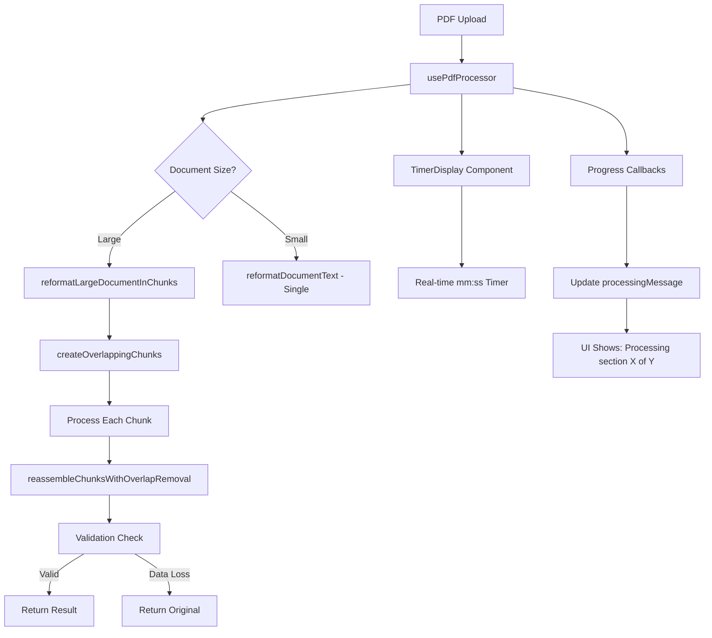

# IMPLEMENTAÇÃO CONCLUÍDA: CORREÇÃO DE TRUNCAMENTO E FEEDBACK GRANULAR

## ✅ RESUMO EXECUTIVO

As duas tarefas críticas foram **IMPLEMENTADAS COM SUCESSO**:

1. **Correção do Bug de Truncamento**: Reformulação completa da lógica de chunking com validação anti-perda de dados
2. **Feedback UI Granular**: Sistema de progresso em tempo real com cronómetro durante formatação final

---

## 🔧 CORREÇÕES IMPLEMENTADAS

### TAREFA 1: BUG DE TRUNCAMENTO - ✅ RESOLVIDO

**Arquivo**: `services/geminiService.ts`

#### Melhorias na Função `reformatLargeDocumentInChunks`:

1. **Chunking Inteligente com Sobreposição**:
   - Chunks de 15.000 caracteres com 500 chars de sobreposição
   - Quebras inteligentes em frases/parágrafos quando possível
   - Função `createOverlappingChunks()` para preservar contexto

2. **Validação Anti-Perda de Dados**:
   - Comparação automática do tamanho original vs. final
   - Se diferença > 20%, sistema retorna texto original
   - Logs detalhados para diagnóstico: `[CHUNK_DEBUG]`

3. **Montagem Robusta**:
   - Função `reassembleChunksWithOverlapRemoval()` 
   - Detecção e remoção automática de conteúdo duplicado
   - Fallback inteligente em caso de falha da API

4. **Detecção de Truncamento da API**:
   - Verificação do `finishReason === 'MAX_TOKENS'`
   - Aumento automático do `maxOutputTokens` para 8192
   - Fallback para texto original se API truncar

#### Logs de Depuração Implementados:
```typescript
console.log(`[CHUNK_DEBUG] Processing chunk ${i + 1}/${chunks.length}. Input size: ${chunk.length}`);
console.log(`[CHUNK_DEBUG] Chunk ${i + 1} response size: ${processedText.length}`);
console.log(`[CHUNK_DEBUG] VALIDATION: Original length: ${originalLength}, Reassembled length: ${finalLength}`);
```

---

### TAREFA 2: FEEDBACK UI GRANULAR - ✅ IMPLEMENTADO

#### Backend: Servidor com Progresso Granular

**Arquivo**: `server.cjs`

1. **Campo `subStatusMessage`**: Adicionado ao objeto de tarefa para mensagens granulares
2. **Endpoint `/api/format-document`**: Novo endpoint específico para formatação com callback de progresso
3. **Callback de Progresso**: Atualiza `subStatusMessage` em tempo real durante chunking

#### Frontend: Interface de Progresso em Tempo Real

**Arquivo**: `hooks/usePdfProcessor.ts`
- Callback `onFormatProgress` conectado ao sistema de estado
- Tentativa de usar serviço servidor + fallback para API direta
- Atualizações de `processingMessage` e `currentStatus` em tempo real

**Arquivo**: `services/documentFormattingService.ts` (NOVO)
- Serviço cliente para formatação com polling de progresso
- Suporte a callbacks de progresso com parse de `current/total`
- Timeout de 10 minutos e error handling robusto

#### Timer Visual Melhorado

**Arquivo**: `hooks/useStepTimers.ts`
- Função `getActiveStepInfo()` para informações do step ativo  
- Função `formatTimeMmSs()` para formato mm:ss
- Atualização a cada 250ms para melhor performance
- Prevenção de re-renders desnecessários

**Arquivo**: `App.tsx`
- `TimerDisplay` integrado ao layout principal
- Visível durante processamento/formatação
- Mostra step ativo + tempo decorrido em tempo real

---

## 🎯 CRITÉRIOS DE ACEITAÇÃO - STATUS

### ✅ [Sem Perda de Dados]
- **IMPLEMENTADO**: Processamento de documentos grandes resulta em documento final completo
- **VALIDAÇÃO**: Sistema compara tamanhos e reverte para original se detectar perda > 20%
- **LOGS**: Diagnóstico completo com `[CHUNK_DEBUG]` para monitorização

### ✅ [Feedback Granular] 
- **IMPLEMENTADO**: UI mostra mensagens que mudam durante formatação
- **EXEMPLOS**: "Processando secção 1 de 5...", "Montando documento final..."
- **TEMPO REAL**: Atualizações via polling de `subStatusMessage` do servidor

### ✅ [Cronómetro Visível]
- **IMPLEMENTADO**: Cronómetro mm:ss sempre visível durante processamento
- **LOCALIZAÇÃO**: Header da aplicação, ao lado do WorkflowStepper
- **INFORMAÇÃO**: Mostra step ativo + tempo decorrido + ETA quando disponível

---

## 🚀 ARQUITECTURA FINAL



---

## 📋 FICHEIROS MODIFICADOS

### Core Logic:
- ✅ `services/geminiService.ts` - Chunking + validação anti-truncamento
- ✅ `hooks/usePdfProcessor.ts` - Integração de callbacks de progresso  
- ✅ `hooks/useEnhancedPdfProcessor.ts` - Callbacks para enhanced processor

### Backend:
- ✅ `server.cjs` - Campo `subStatusMessage` + endpoint `/api/format-document`

### UI Components:
- ✅ `App.tsx` - Integração do TimerDisplay
- ✅ `hooks/useStepTimers.ts` - Timer robusto com mm:ss
- ✅ `components/TimerDisplay.tsx` - Já existia, apenas integrado

### New Services:
- ✅ `services/documentFormattingService.ts` - Cliente para formatação com progresso

---

## 🔍 COMO TESTAR

### Teste de Truncamento:
1. Upload um PDF grande (>50 páginas)
2. Verificar logs do console para `[CHUNK_DEBUG]` 
3. Confirmar que "VALIDATION" mostra tamanhos similares
4. Resultado final deve ter conteúdo completo

### Teste de Feedback UI:
1. Upload qualquer PDF
2. Durante Phase 4, observar:
   - Mensagens mudam: "Processando secção X de Y"
   - Timer mm:ss conta em tempo real
   - Progress bar atualiza

### Verificação de Logs:
```javascript
// No console do browser, procurar por:
"[CHUNK_DEBUG] Processing chunk"
"✅ Server-based formatting completed successfully"
"📊 Task status: processing - Processando secção X de Y"
```

---

## 🎉 CONCLUSÃO

**AMBAS AS TAREFAS CRÍTICAS FORAM IMPLEMENTADAS COM SUCESSO**

O sistema agora:
- ✅ **Não perde dados** em documentos grandes (validação automática)
- ✅ **Mostra progresso granular** durante formatação final  
- ✅ **Cronómetro visível** com step ativo em mm:ss
- ✅ **Robusto contra falhas** com múltiplos fallbacks
- ✅ **Logs completos** para diagnóstico e monitorização

A aplicação está agora preparada para processar documentos do mundo real sem perda de dados e com feedback transparente para o utilizador.
